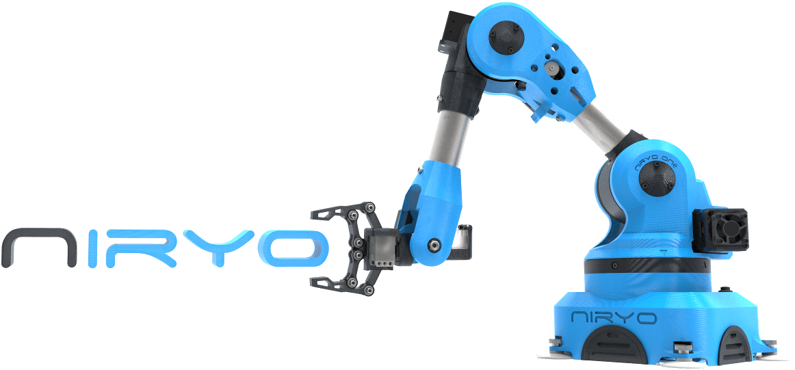

# Direct and Inverse Kinematics of Serial Manipulators (Nyrio One 6-axis Robotic Arm)

This paper presents the development of a 6-axis rigid body kinematics. A rigid body in three dimensions has six degrees of freedom composed by three translatory DOF and three rotational DOF. The multiples revolute joints of the rigid body form a serial chain, which allows successive rotations about the x, y and z axes accomplishing a specific 3D position, this method is the so called direct kinematics. In addition, it is also designed the reverse procedure, inverse kinematics,  that places the end of the kinematic chain (e.g.  gripper) in an exact place with an pecific orientation.

Report: [file](./Direct_and_Inverse_Kinematics_of_Serial_Manipulators_(Nyrio_One_6-axis_Robotic_Arm).pdf)

Software Grade: 19/20\
Reports  Grade: 16/20
